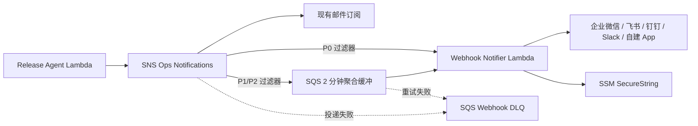

# AIOps App Webhook 通知

## 1. 目标

在现有邮件通知之外，为异常运维事件增加 App Webhook 通知，并控制通知频率：

- `CRITICAL -> P0`：立即发送。
- `DEGRADED -> P1`：进入 2 分钟聚合窗口。
- `UNKNOWN -> P2`：进入 2 分钟聚合窗口。
- `HEALTHY`：不发送通知。

邮件订阅仍然逐条发送，不参与聚合。当前 App Webhook 支持：

- 飞书自定义机器人：`feishu`
- 钉钉自定义机器人：`dingtalk`
- 企业微信群机器人：`wecom`
- Slack Incoming Webhook：`slack`
- 自建 HTTPS Webhook：`generic`

Webhook 是可选功能。没有设置 `OPS_WEBHOOK_PARAMETER_NAME` 时，SAM 不会创建 Webhook Lambda、SNS 订阅和对应 DLQ。

## 2. 链路



安全边界：

- Webhook URL 只保存在 SSM Parameter Store `SecureString` 中。
- GitHub 只保存 SSM 参数名称与消息格式，不保存 URL。
- Webhook Lambda 不加入业务 VPC，只向 HTTPS 地址发请求。
- Lambda 日志不会打印 Webhook URL。
- SNS 无法调用 Lambda，或 Lambda 重试后仍无法把消息发送给 App，都会进入独立 DLQ，保留 14 天。
- P1/P2 使用 SQS 的 Lambda 批处理窗口做低成本聚合；同一批次只调用一次 App Webhook。
- 聚合消息包含最高优先级、总数、P1/P2 数量、去重摘要和去重后的处置建议。

## 3. 创建机器人 Webhook

在目标 App 中创建群机器人或 Incoming Webhook，取得 HTTPS URL。不要把 URL 发到聊天、提交到 Git，或写入 `.env`。

如果机器人启用了签名密钥等额外校验，需要先关闭签名校验，只保留平台自带的随机 Webhook URL。当前实现尚未计算飞书或钉钉签名。

## 4. 保存到 SSM

推荐参数名：`/bhb-login/ops/webhook`。

在 AWS 控制台进入 **Systems Manager -> Parameter Store -> Create parameter**：

1. Name：`/bhb-login/ops/webhook`
2. Tier：`Standard`
3. Type：`SecureString`
4. KMS key source：使用当前账号默认密钥
5. Value：粘贴机器人 HTTPS Webhook URL

也可以在本地执行，命令会在终端输入中包含 URL，注意不要保存到 shell 历史或录屏：

```bash
aws ssm put-parameter \
  --profile bhb-new \
  --region ap-northeast-1 \
  --name /bhb-login/ops/webhook \
  --type SecureString \
  --value '替换为真实的 HTTPS Webhook URL' \
  --overwrite
```

## 5. 配置 GitHub

进入 GitHub 仓库：

```text
Settings -> Environments -> production -> Environment variables
```

增加：

| 变量 | 示例 | 是否敏感 |
| --- | --- | --- |
| `OPS_WEBHOOK_PARAMETER_NAME` | `/bhb-login/ops/webhook` | 否 |
| `OPS_WEBHOOK_PROVIDER` | `feishu` | 否 |

`OPS_WEBHOOK_PROVIDER` 只能使用 `feishu`、`dingtalk`、`wecom`、`slack` 或 `generic`。

设置完成后，手动运行 **Deploy Ops Agents** 工作流，或推送相关代码。CloudFormation 会创建：

- `${SAM_STACK_NAME}-ops-webhook` Lambda
- `${SAM_STACK_NAME}-ops-webhook-buffer` SQS 聚合缓冲队列
- `${SAM_STACK_NAME}-ops-webhook-dlq` SQS
- SNS 到 Lambda 的 P0 直达订阅
- SNS 到缓冲队列的 P1/P2 聚合订阅

## 6. 验收

### 6.1 查看部署输出

```bash
aws cloudformation describe-stacks \
  --profile bhb-new \
  --region ap-northeast-1 \
  --stack-name bhb-login-ops \
  --query "Stacks[0].Outputs[?OutputKey=='WebhookNotifierFunctionName' || OutputKey=='OpsWebhookBufferQueueUrl' || OutputKey=='OpsWebhookDlqUrl']" \
  --output table
```

### 6.2 触发真实通知

使用现有告警测试链路分别产生 P0、P1 和 P2 结果。预期：

1. 原有邮箱继续收到通知。
2. P0 立即到达 App，日志中的 `mode` 为 `immediate`。
3. 2 分钟内产生的 P1/P2 合并为一条 App 消息，日志中的 `mode` 为 `aggregated`。
4. CloudWatch 日志出现 `ops.webhook.delivered`。

查询日志：

```bash
aws logs tail /aws/lambda/bhb-login-ops-webhook \
  --profile bhb-new \
  --region ap-northeast-1 \
  --since 10m
```

### 6.3 检查失败队列

如果 App 没有收到消息，先查看 Lambda 日志，再检查 `OpsWebhookDlqUrl` 对应队列的可见消息数。常见原因包括机器人 URL 失效、平台签名校验未关闭或平台返回非 2xx 状态码。

## 7. 费用说明

这条链路按调用量计费，没有新的固定月费。与逐条通知相比，只增加少量 SQS 请求：

- SSM Standard 参数不收参数存储费。
- Lambda 使用 ARM64、128 MB，仅告警时执行。
- SNS 与 SQS 只处理少量运维通知。

在当前演示项目的低频告警量下，通常落在免费额度或接近 `0` 美元。不要为了验证持续制造高频告警。
