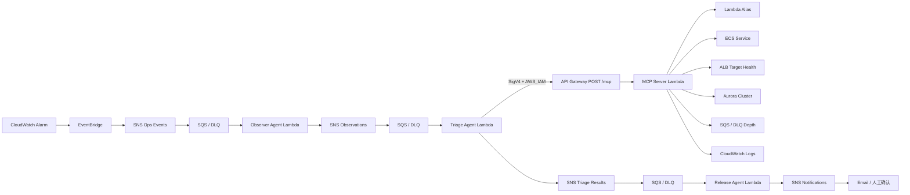

# AIOps Agent + 自建 MCP Server 作业说明

## 1. 作业目标

在现有 `Observer -> Triage -> Release` 运维链路上，完整实现一个由 AWS 托管的诊断 Agent：

1. CloudWatch 告警经 EventBridge、SNS 和 SQS 触发 Observer Agent。
2. Observer Agent 采集基础资源快照并发布观察结果。
3. Triage Agent 作为 MCP Client，通过 IAM 鉴权调用自建 MCP Server。
4. MCP Server 查询 Lambda、ECS、ALB、Aurora、SQS/DLQ 和近期 CloudWatch Logs。
5. Triage Agent 合并 Observer 与 MCP 证据，输出严重级别、建议动作和人工审批要求。
6. Release Agent 只负责通知与门禁，不自动执行有风险的修复。

AWS 部署是主验收路径。本地 `stdio` 模式用于开发和演示，属于选做，但复用同一套 MCP 工具实现。

## 2. 架构



边界说明：

- MCP Server Lambda 不加入业务 VPC，只访问 AWS 控制面 API，不读取 Aurora 表数据。
- `/mcp` 是公网域名，但 API Gateway 路由使用 `AWS_IAM`；没有 SigV4 和 `execute-api:Invoke` 权限无法调用。
- MCP Server IAM 仅包含只读动作，所有工具都声明 `readOnlyHint: true`。
- Triage Agent 调用 MCP 失败时降级为原有规则诊断，告警消息不会因此丢失。

## 3. MCP 工具

| 工具 | 用途 | 是否写资源 |
| --- | --- | --- |
| `collect_incident_context` | 聚合完整事件上下文 | 否 |
| `get_lambda_alias_health` | 查询 Lambda `live` 别名和灰度流量 | 否 |
| `get_ecs_service_health` | 查询 ECS Service 与任务数量 | 否 |
| `get_alb_target_health` | 查询 ALB Target 健康状态 | 否 |
| `get_aurora_health` | 查询 Aurora 状态与 Serverless 容量 | 否 |
| `get_queue_health` | 查询业务 SQS 和 DLQ 深度 | 否 |
| `get_recent_logs` | 查询白名单内的项目日志组 | 否 |

## 4. 本地运行（选做）

### 4.1 准备参数

在根目录 `.env` 中填写 `OPS_*` 占位参数的真实资源标识，并确保本机 AWS CLI 使用 `bhb-new`：

```bash
export AWS_PROFILE=bhb-new
export AWS_REGION=ap-northeast-1
set -a
source .env
set +a
```

### 4.2 启动 stdio MCP Server

```bash
pnpm --filter ops-mcp-server dev
```

它是 stdio 协议进程，终端没有普通 HTTP 页面属于正常现象。

### 4.3 使用 MCP Inspector

```bash
pnpm dlx @modelcontextprotocol/inspector \
  pnpm --filter ops-mcp-server dev
```

在 Inspector 中验证：

1. `tools/list` 能看到 7 个工具。
2. 调用 `collect_incident_context`。
3. 返回 `ops.mcp.context.collected`。
4. `resources` 中包含 Lambda、ECS、ALB、Aurora、SQS 和日志查询结果。

## 5. AWS 部署（必做）

部署由 `.github/workflows/deploy-ops-agent.yml` 完成：

```text
push main
  -> GitHub Actions
  -> OIDC AssumeRole
  -> build ops-agent + ops-mcp-server
  -> SAM / CloudFormation
  -> MCP Lambda + IAM HTTP API + Triage Client
```

不需要新增 GitHub Secret。现有 `AWS_ROLE_TO_ASSUME` 和主栈输出即可完成部署。

## 6. AWS 验收

### 6.1 查看 MCP 输出

```bash
aws cloudformation describe-stacks \
  --profile bhb-new \
  --region ap-northeast-1 \
  --stack-name bhb-login-ops \
  --query "Stacks[0].Outputs[?OutputKey=='OpsMcpEndpoint']" \
  --output table
```

### 6.2 验证未签名请求被拒绝

```bash
curl -i "$(aws cloudformation describe-stacks \
  --profile bhb-new \
  --region ap-northeast-1 \
  --stack-name bhb-login-ops \
  --query "Stacks[0].Outputs[?OutputKey=='OpsMcpEndpoint'].OutputValue" \
  --output text)"
```

预期为 `403`，证明公网端点不能匿名调用。

### 6.3 触发完整 Agent 链路

使用现有测试告警或发送 CloudWatch Alarm State Change 测试事件。然后查询：

```bash
aws logs tail /aws/lambda/bhb-login-ops-triage \
  --profile bhb-new \
  --region ap-northeast-1 \
  --since 10m \
  --follow
```

验收日志应包含：

- `type: ops.triage.completed`
- `mcpEvidence.status: ok`
- `mcpEvidence.collectedAt`
- 严重级别和建议动作

如果严重级别是 `DEGRADED` 或 `CRITICAL`，Release Agent 会经 SNS 向已确认的邮箱发送人工确认通知。

## 7. 完成标准

- [x] 自建标准 MCP Server
- [x] 本地 stdio 运行入口
- [x] 7 个只读 AWS 运维工具
- [x] Triage Agent 作为 MCP Client 调用
- [x] MCP 失败降级策略
- [x] API Gateway `AWS_IAM` 鉴权
- [x] SAM 与 GitHub Actions 部署代码
- [x] 单元测试与 MCP 工具发现测试
- [ ] AWS 部署成功
- [ ] 线上告警端到端验证完成
