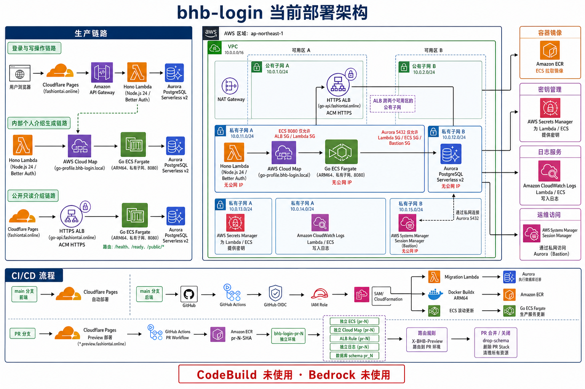
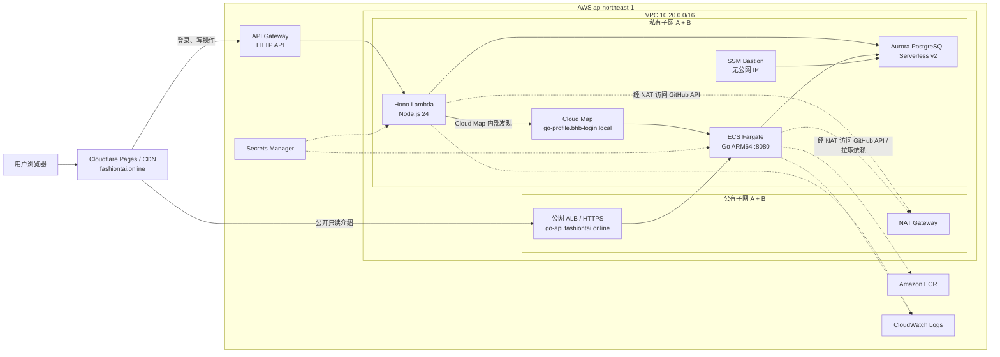
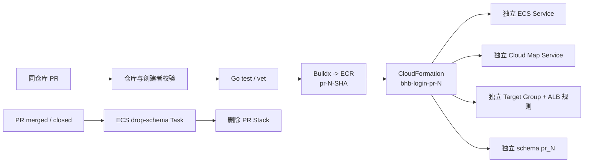

# bhb-login 部署演进与当前架构

> 最后核对：2026-07-25
>
> 代码仓库：<https://github.com/fashiontai/bhb-login>

本文记录 `bhb-login` 从单体登录示例演进到 Cloudflare + AWS 混合云部署的过程，并描述当前已经落地的生产架构。实际资源定义以 [`template.yaml`](../template.yaml)、[`deploy-aws-sam.yml`](../.github/workflows/deploy-aws-sam.yml) 和 [`deploy-pr-preview.yml`](../.github/workflows/deploy-pr-preview.yml) 为准。

## 1. 当前结论

| 能力 | 当前实现 | 状态 |
| --- | --- | --- |
| 前端 | React/Vite，Cloudflare Pages 托管 | 已上线 |
| 登录系统 | Better Auth + Hono Lambda | 已上线 |
| Node API | API Gateway HTTP API + Lambda | 已上线 |
| Go 服务 | ECR + ECS Fargate ARM64 | 已上线 |
| 服务发现 | Lambda 通过 Cloud Map 访问 Go | 已上线 |
| Go 公共接口 | HTTPS ALB，仅转发只读和健康检查路径 | 已上线 |
| 数据库 | Aurora PostgreSQL Serverless v2 | 已上线 |
| 本地连库 | SSM Bastion 端口转发 | 已上线 |
| 后端 CI/CD | GitHub Actions + OIDC + SAM | 已上线 |
| PR 独立环境 | Cloudflare Preview + GitHub Actions + 独立 ECS/Schema | 已验证 |
| CodeBuild | 因账号并发配额为 0，改由 GitHub Actions 执行 | 未使用 |
| Bedrock | 当前业务不需要 | 未使用 |

## 2. 演进过程

### 2.1 前端进入 monorepo

旧前端项目迁入 `apps/web` 后，组件边界固定为：

- `apps/web`：路由、登录注册表单、状态、API 调用等业务代码。
- `packages/ui`：可复用的视觉组件和样式。
- `packages/auth`：Better Auth 服务端配置。
- `packages/db`：Prisma Client、Schema 和迁移逻辑。

前端提供中英文切换、注册、登录、会话守卫、退出登录、GitHub 资料管理和个人介绍页面。

### 2.2 从本地 PostgreSQL 到 Aurora

本地 PostgreSQL 用于开发验证，生产数据库改为 Aurora PostgreSQL Serverless v2。数据库位于私有子网，不开放公网，只接受以下安全组来源的 5432 连接：

- Lambda Security Group
- Go ECS Security Group
- SSM Bastion Security Group

数据库凭据由 Secrets Manager 保存，不写入 GitHub、代码或文档。

### 2.3 Node 后端迁入 Lambda

Hono 应用由 API Gateway HTTP API 对外提供服务，由 Lambda 在 VPC 私有子网运行。Node 服务负责：

- Better Auth 登录、注册和会话接口。
- GitHub Token 鉴权后读取用户资料。
- GitHub 账户及扩展字段 CRUD。
- 鉴权后的个人介绍生成入口。
- 通过 Cloud Map 调用 Go 内部接口。

### 2.4 Go 服务进入 ECS Fargate

Go 服务打包为 Linux ARM64 Docker 镜像并保存到 ECR。ECS Fargate Task 位于私有子网且没有公网 IP，负责：

- `/health`：进程健康检查。
- `/ready`：数据库就绪检查。
- `GET /public/v1/introductions/:username`：公开只读个人介绍。
- `POST /internal/v1/introductions/generate`：仅允许 Lambda 使用内部 Token 调用。

生产 ECS Service 同时注册到 Cloud Map 和 ALB Target Group：

- Cloud Map 处理 Lambda 到 Go 的 VPC 内部调用。
- ALB 处理浏览器到 Go 的公开只读调用。

### 2.5 前后端分离部署

前端不再放入 AWS S3/CloudFront。Cloudflare Pages 负责静态文件、全球 CDN 和自定义域名；AWS 只负责后端计算、网络与数据库。

这样前端发布不需要等待 SAM，后端变更也不会重复构建前端。

### 2.6 从 CodeBuild 改为 GitHub Actions

最初计划使用 CodeBuild 构建 PR Go 镜像，但新 AWS 账号的 ARM/Small 并发配额为 0。为了避免阻塞开发，最终改为 GitHub Actions：

- GitHub Hosted Runner 执行 Go 测试和 Docker Buildx。
- GitHub OIDC 临时取得 AWS Role，不保存长期 Access Key。
- 镜像推送 ECR。
- CloudFormation 创建或删除 PR Stack。

旧 CodeBuild Project、Webhook、Role 和模板定义已经删除。

## 3. 当前生产架构



上图用于快速理解整体结构；下面的 Mermaid 图和仓库基础设施模板是网络关系与资源配置的精确来源。



## 4. 请求链路

### 4.1 登录与 Node API

```text
浏览器
  -> Cloudflare Pages
  -> API Gateway
  -> Hono Lambda
  -> Aurora PostgreSQL
```

跨域请求使用 `credentials: include`。服务端 CORS 只允许配置的生产域名和受信任的 Cloudflare Pages 域名。

### 4.2 生成个人介绍

```text
浏览器
  -> POST /api/introductions/generate
  -> API Gateway
  -> Hono Lambda（验证 Better Auth 会话）
  -> Cloud Map: go-profile.bhb-login.local
  -> Go Fargate: POST /internal/v1/introductions/generate
  -> GitHub API + Aurora
```

Lambda 调用 Go 时携带 `X-Internal-Service-Token`。Go 服务使用恒定时间比较校验 Token。

### 4.3 读取公开介绍

```text
浏览器
  -> https://go-api.fashiontai.online
  -> HTTPS ALB
  -> Go Fargate
  -> Aurora
```

生产 ALB 只转发以下路径：

- `/health`
- `/ready`
- `/public/*`

其他路径由 HTTPS Listener 返回 404。HTTP 80 自动跳转到 HTTPS 443，证书由 ACM 提供。

## 5. 网络与安全边界

| 资源 | 网络位置 | 访问限制 |
| --- | --- | --- |
| API Gateway | AWS 托管公网入口 | 转发到 Lambda |
| ALB | 两个公有子网 | 80/443；业务规则仅公开只读路径 |
| Lambda | 两个私有子网 | 无公网 IP |
| ECS Fargate | 两个私有子网 | 无公网 IP；8080 仅允许 ALB SG、Lambda SG |
| Aurora | DB Subnet Group | 无公网访问；5432 仅允许 Lambda/ECS/Bastion SG |
| SSM Bastion | 私有子网 | 无入站端口、无公网 IP，通过 SSM 管理 |
| NAT Gateway | 公有子网 A | 私有子网主动访问公网，不接受公网入站 |

ALB 必须关联至少两个不同可用区的子网，因此当前网络包含公有子网 A/B。Lambda、ECS 和 Aurora 同样跨两个私有子网部署或注册，但生产 ECS 的 `DesiredCount` 默认是 1，不代表固定运行两个 Task。

## 6. 生产 CI/CD

### 6.1 前端

```text
main 前端代码变更
  -> Cloudflare Pages Git 集成
  -> pnpm --filter web build
  -> apps/web/dist
  -> fashiontai.online
```

Cloudflare Pages 生产变量：

```text
NODE_VERSION=24
VITE_SERVER_URL=https://sh590qarl2.execute-api.ap-northeast-1.amazonaws.com
VITE_GO_PROFILE_URL=https://go-api.fashiontai.online
```

### 6.2 后端

```mermaid
flowchart LR
  Push["main 后端代码变更"] --> Actions["GitHub Actions"]
  Actions --> OIDC["GitHub OIDC"]
  OIDC --> IAM["github-actions-bhb-login"]
  IAM --> Check["TS 检查 + Go test/vet + SAM validate"]
  Check --> Base["SAM 部署基础栈"]
  Base --> Migration["Migration Lambda"]
  Migration --> Build["Docker Buildx ARM64"]
  Build --> ECR["ECR SHA + latest"]
  ECR --> Runtime["SAM 更新 ECS Task Definition"]
```



后端工作流只在 AWS/后端相关路径变化时触发。数据库迁移发生在新 Go Runtime 切换之前，迁移必须保持向后兼容。

## 7. PR 独立环境

PR 前端由 Cloudflare Pages 自动生成 Preview。Vite 根据 `CF_PAGES_BRANCH` 计算 `VITE_PREVIEW_ID`，无需手工维护每个分支变量。

PR 后端由 `.github/workflows/deploy-pr-preview.yml` 管理：



每个 PR 共享生产 VPC、ECS Cluster、ALB、Aurora、IAM Task Role 和 ECR Repository，但隔离以下资源：

- 镜像 Tag
- ECS Service 和 Task Definition
- Cloud Map Service
- Security Group
- Target Group 和 Listener Rule
- CloudWatch Log Group
- PostgreSQL Schema

PR 请求通过 `X-BHB-Preview: <preview-id>` 命中对应 ALB Rule；Lambda 读取同一 Header 后解析对应 Cloud Map 域名。PR 编号同时作为 Listener Rule Priority，允许范围为 1 到 49000，生产规则固定为 50000。

安全限制：PR 工作流只接受当前仓库内、由 `fashiontai` 创建的 PR，不执行 Fork PR 的 AWS 部署代码。

## 8. 数据库迁移

生产部署调用 `${STACK_NAME}-migrate` Lambda。迁移函数在 VPC 内连接 Aurora，并维护 `_prisma_migrations`：

- `20260705153000_init`
- `20260724120000_personal_introduction`

PR 环境使用 Go 一次性 Fargate Task：

- 创建：执行 `migrate`，创建 `pr_<number>` schema。
- 清理：执行 `drop-schema`，拒绝删除 `public` schema。

## 9. 当前公开地址

| 用途 | 地址 |
| --- | --- |
| 前端生产 | <https://fashiontai.online> |
| Cloudflare 备用地址 | <https://bhb-login.pages.dev> |
| Node/Hono API | <https://sh590qarl2.execute-api.ap-northeast-1.amazonaws.com> |
| Go 公共 API | <https://go-api.fashiontai.online> |
| GitHub | <https://github.com/fashiontai/bhb-login> |

AWS Region 为 `ap-northeast-1`，生产 Stack 为 `bhb-login`，GitHub Actions IAM Stack 为 `bhb-login-github-actions-role`。

## 10. 已验证状态

2026-07-25 完成以下真实环境验证：

- 生产 CloudFormation Stack：`UPDATE_COMPLETE`。
- IAM Stack：`UPDATE_COMPLETE`。
- ECS Service：`desired=1`、`running=1`、`rollout=COMPLETED`。
- Node 根接口和 `/api/hello` 返回成功。
- Go `/health` 和公开个人介绍接口返回成功。
- Cloudflare 自定义域名返回 HTTP 200。
- PR #1 成功创建并更新独立环境。
- PR #1 合并后，`pr_1` schema 和 `bhb-login-pr-1` Stack 清理成功。
- CodeBuild Project 和临时 IAM Policy 已删除。

## 11. 当前未建设能力

以下内容不属于当前系统，不应画入“已部署架构”：

- CodeBuild
- Bedrock 或其他生成式 AI 服务
- SNS、SQS、DLQ、Event Worker
- X-Ray、Synthetics Canary、P1/P2/P3 自动告警
- S3/CloudFront 前端托管
- EKS/Kubernetes
- AIOps Agent 和自动恢复

后续优先级应是 CloudWatch 指标告警、AWS Budget 和运行手册，而不是继续堆叠未被业务使用的服务。

## 12. 关键经验

1. ALB 至少需要两个不同可用区的子网，单一公有子网无法创建标准互联网 ALB。
2. Lambda 放进 VPC 后不会自动拥有公网访问能力；调用 GitHub API 需要 NAT Gateway 或相应网络出口。
3. Cloud Map 只负责服务发现，实际端口访问仍由安全组控制。
4. 浏览器不能从 HTTPS 页面调用 HTTP ALB，Go 公共接口必须使用 ACM + HTTPS。
5. GitHub Actions 使用 OIDC 后无需保存 AWS Access Key，但 IAM Role 仍应限制仓库、分支/Environment 和动作范围。
6. SAM `--resolve-s3` 的 Bucket 创建、加密、版本和标签都需要对应 S3 权限。
7. CloudFormation 资源进入失败状态时先看 Stack Events，不要连续盲目重跑。
8. PR 环境必须自动销毁，否则 ECS、ALB Target Group、日志和数据库 schema 会持续累积。
